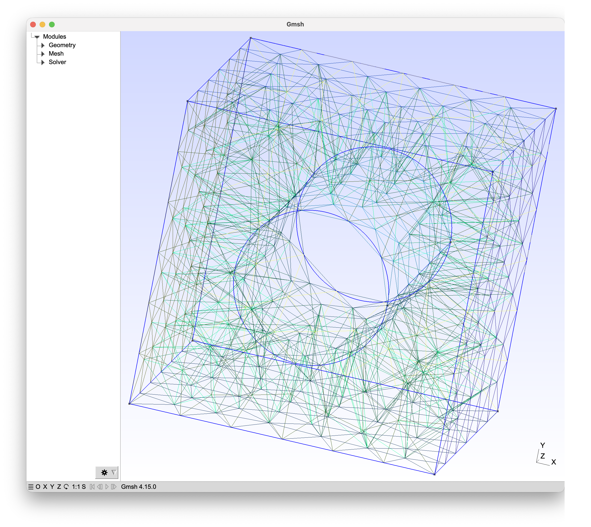

# Autonomous AI Foundry for Elastocaloric Metamaterials

### The Vision
A localized, end-to-end deep-tech software pipeline that autonomously designs, mathematically simulates, and optimizes 3D metamaterials for solid-state elastocaloric cooling systems.

### The Architecture
This project bridges three heavy computational domains to bypass human CAD design and discover novel shape-memory alloy structures (like Nitinol):

1. **Automated CAD & Meshing (OpenCASCADE / Gmsh):** Autonomously generates parametric 3D unit cells and physical mesh networks.
2. **Physics Simulation (FEniCSx):** Solves heavy finite element differential equations (hyperelasticity) to mathematically crush the shapes and calculate internal Von Mises stress in Megapascals.
3. **Machine Learning (PyTorch Geometric):** Translates physical meshes into mathematical tensors to train a Graph Neural Network (GNN). The AI learns the physics from the FEniCSx data to instantly predict structural failure, acting as a high-speed surrogate model.

### Core Pipeline
* `generate_dataset.py`: Spins up localized CPU multi-processing to mass-produce mathematically validated 3D shapes and save them as PyTorch tensors.
* `train_ai.py`: The training loop for the Graph Neural Network.
* `ai_invent.py`: The AI Inference engine. Bypasses the heavy physics simulator to instantly predict mechanical stress based on learned geometry.
* `view_model.py`: Interactive 3D visualizer for the generated CAD structures. 

*Note: The proprietary dataset and trained brain weights (`.pth`) are kept locally and ignored via `.gitignore` to protect IP.*