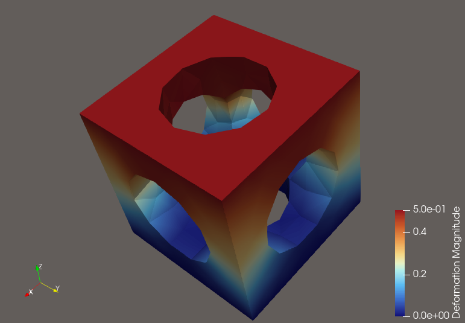

# elastocaloric-ai-optimization
I-Driven Topological Optimization of Elastocaloric Metamaterials: Resolving the Fatigue-Porosity Paradox in Solid-State Cooling
# Elastocaloric-AI: DRL Topology Optimization for Solid-State Cooling 🥶⚙️

[](https://opensource.org/licenses/MIT)
[](https://www.python.org/)
[](https://fenicsproject.org/)
[](https://pytorch.org/)

An end-to-end computational mechanics pipeline that uses Deep Reinforcement Learning (DRL) to autonomously design 3D-printable elastocaloric heat exchangers. 




## 🚨 The Problem: The Airflow vs. Fatigue Paradox
The HVAC industry is phasing out hydrofluorocarbon (HFC) refrigerants in favor of solid-state **elastocaloric cooling** (mechanically compressing Shape Memory Alloys like Nitinol). 

To function as a heat exchanger, the Nitinol must be a porous metamaterial (like a Gyroid or BCC lattice) to allow air to flow through it. However, high porosity creates severe structural stress concentrators. Human-designed lattices often snap after a few thousand compression cycles. 

## 🧠 The Solution: Autonomous Design Generation
This repository provides a complete, automated pipeline that trains an AI to discover alien, highly efficient lattice geometries that balance cooling capacity with structural survivability, while strictly adhering to Additive Manufacturing (LPBF) limitations.

### Core Features:
* **Native CAD Generation:** Bypasses degenerate `.stl` files by mathematically generating watertight OpenCASCADE geometries and 3D tetrahedral meshes using `Gmsh`.
* **High-Fidelity Physics Engine:** Utilizes `FEniCSx` (dolfinx) to simulate a virtual hydraulic press, calculating linear elastic deformation and peak stress across the metamaterial.
* **OpenAI Gymnasium Wrapper:** A seamless bridging environment that translates the 3D physics solver into a standard Markov Decision Process (MDP) for AI training.
* **Printability Constraints (LPBF):** Hardcoded physical boundaries instantly penalize the agent if it attempts to generate wall thicknesses below `0.2 mm`, ensuring all output geometries can be successfully 3D printed via Laser Powder Bed Fusion.
* **Apple Silicon Optimized:** Fully leverages Apple Metal Performance Shaders (MPS) for PyTorch neural network training.

---

## 🛠 Installation (macOS Apple Silicon / M-Series)

This project relies on bleeding-edge computational physics libraries. It is highly recommended to use `Miniforge` to manage the `arm64` architecture.

```bash
# 1. Create the dedicated environment
conda create -n elastocaloric_ai python=3.10
conda activate elastocaloric_ai

# 2. Install the FEniCSx physics solver and Gmsh mesher
conda install -c conda-forge fenics-dolfinx gmsh python-gmsh


## 🔮 Future Work & Research Roadmap

This repository represents v1.0 of the Elastocaloric-AI pipeline. The core bridging of DRL, topological constraints, and FEA is functional, but there are three major vectors for future development:

1. Algorithmic Upgrades (Action Space & Policy)

State-of-the-Art RL Integration: Transitioning from the custom PyTorch training loop to robust, industry-standard algorithms like PPO or SAC using Stable-Baselines3.

Functionally Graded Lattices: Expanding the AI's action space from a uniform parameter to a multi-dimensional tensor for spatially varying topologies.

2. Multi-Physics Integration (Non-Linearity & CFD)

Shape Memory Alloy (SMA) Mechanics: Upgrading the FEniCSx solver from a linear elastic approximation to a hyperelastic model that captures Nitinol's superelastic hysteresis loop.

Conjugate Heat Transfer: Integrating a Navier-Stokes fluid solver into the reward function to evaluate true convective airflow.

3. AI Surrogate Modeling (Compute Optimization)

Bypassing the FEA Bottleneck: Training a secondary deep neural network to act as a Surrogate Physics Engine to predict peak stress and deformation in milliseconds, drastically accelerating the DRL training loop.
